# assignment_11_1
This is a submission for - Required Assignment 11.1: What Drives the Price of a Car?

Observations

1 - To predict car prices - Year and Odometer features capture most information.
2 - From Data looks like Porche Sendans sell for higher prices - They tend to be newer, with lower milage(odometer)
3 - Simple linear regression model also shows the positive correlation of price and year, and negative correlation between price and odometer

Steps taken in this assignment - 

Step 1 - Data clean up
1.1 Dropped columns with more than 5% missing data and substituted rows with mean and mode for columns missing less than 5 % data.
1.2 Plotted raw data to assess outliers.
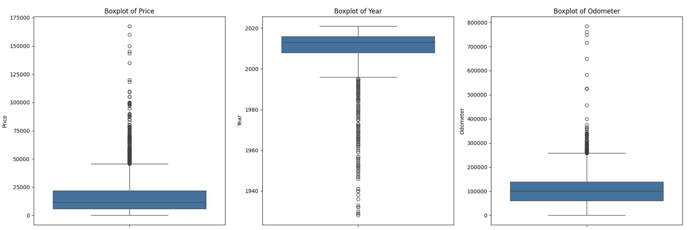
1.3 Dropping Outlier and plotting boxplot 
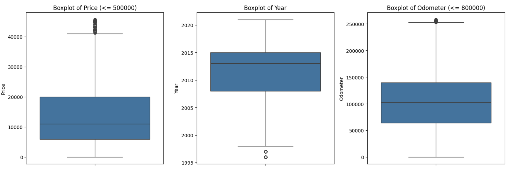

Step 2 - Data Understanding 
2.1 Visualizing the data distribution
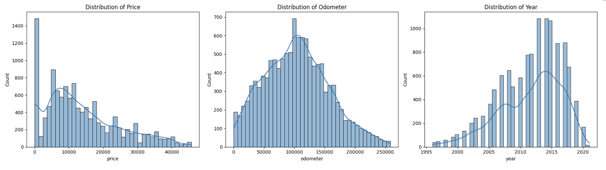
2.2 Scatter plot for numerical features - for data understanding - using log scale for odometer
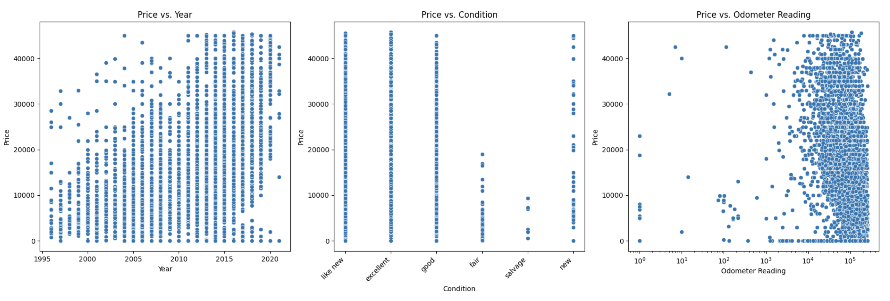
2.3 Scatter plot for numerical features - for data understanding - using log scale for odometer
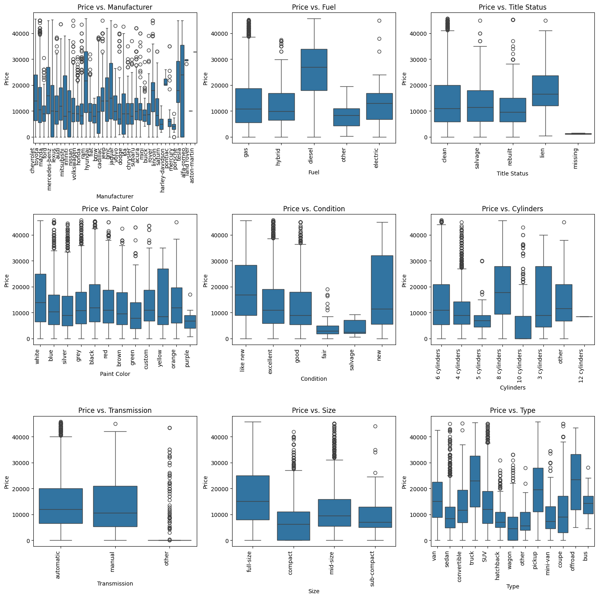
2.4 Correlation matrix 
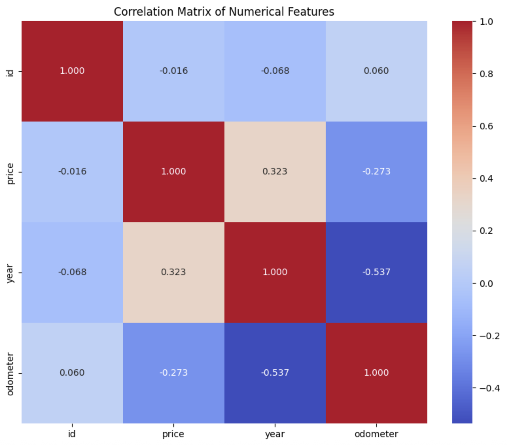

2.4 Deepdive into Sedan data - As it seems to have alot of outliers
2.4.1 - Posche tends to have lower milage, newer model and high prices.
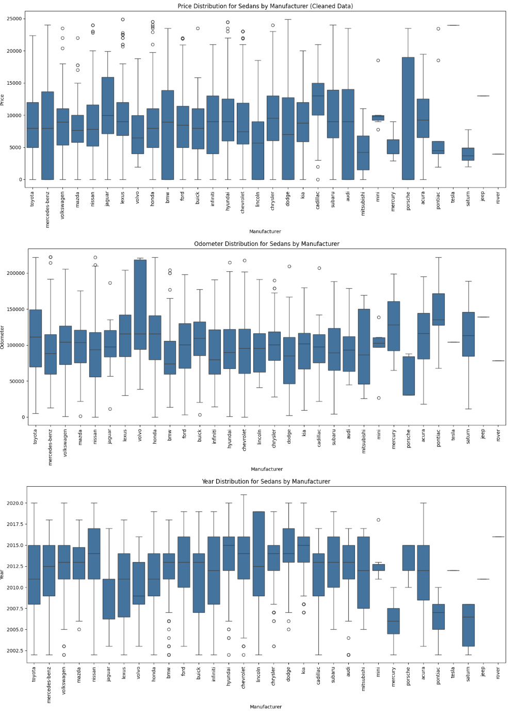

Step 3 - PCA
3.1 Normalization of numerical features and visualize
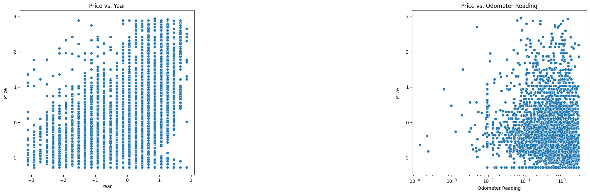
3.2 Scree plots to get optimal features to capture most information from the dataset
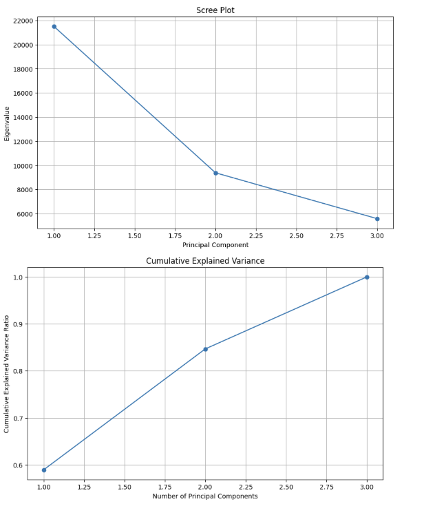
3.3 - 2 components capture ~85% information. Projecting data to PC1,PC2
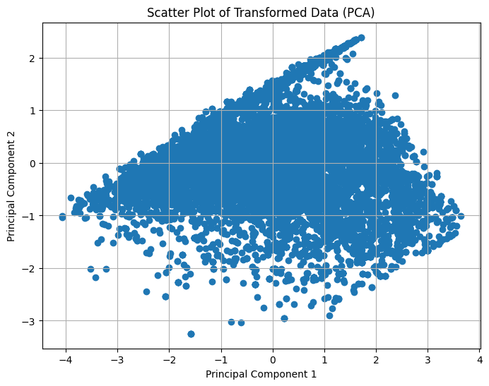
3.4 - Visualizing the loading matrix - Shows relation between Price, Odometer and Year
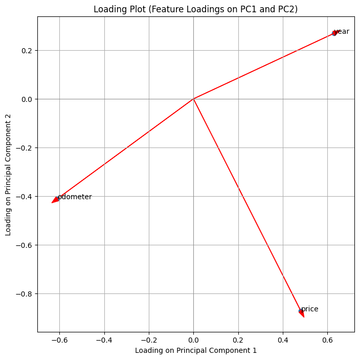

Step 4 - Linear regression model - Creating a linear regression model for Price with Odometer and Year features - shows a positive relation of Price and Year and Negative relation of Price and Odometer.
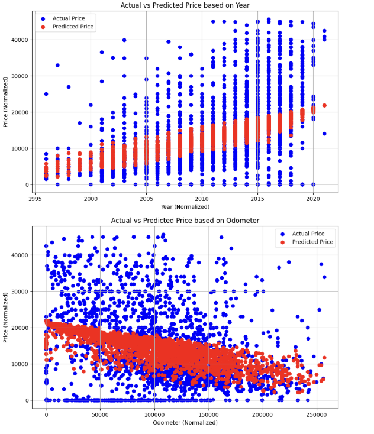

